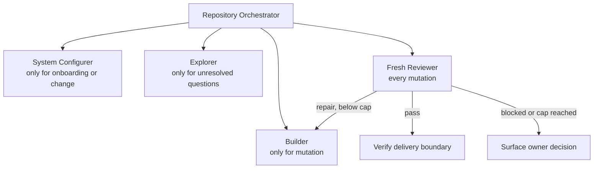
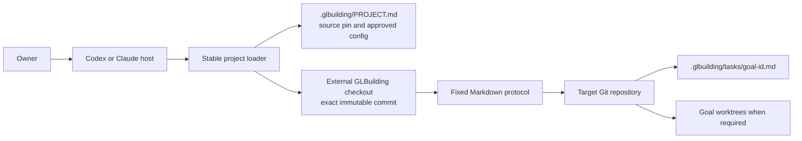
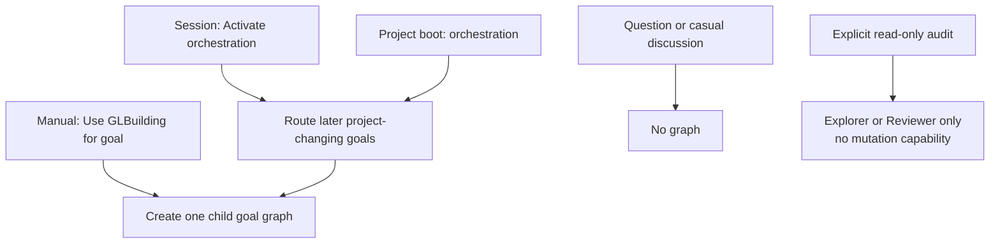
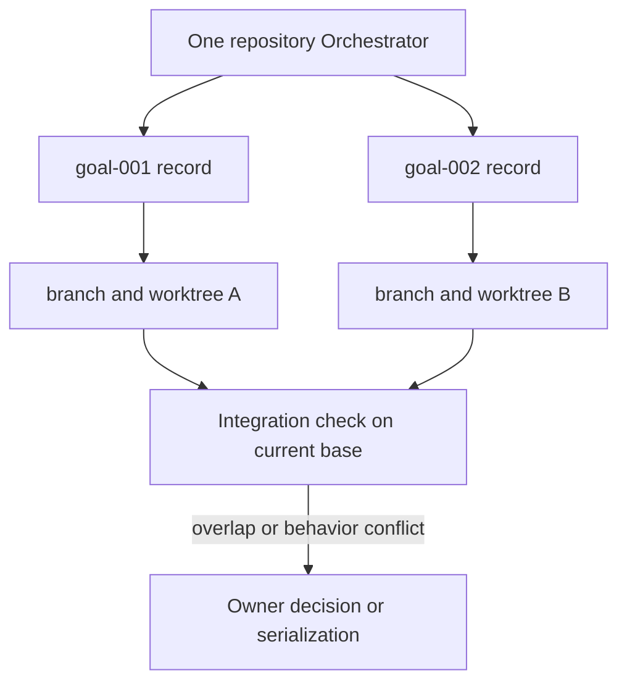

# GLBuilding framework white paper

## Abstract

GLBuilding is a Markdown-only control framework for agent-led software development. It addresses a practical failure mode: one long model session must discover a large codebase, decide scope, edit it, and judge its own work. Context becomes crowded, evidence loses provenance, and self-review inherits the Builder's assumptions.

GLBuilding keeps one small control context and moves bounded work into fresh role contexts. Git stores approved configuration, exact source identity, task state, and isolated work. The host agent supplies execution. GLBuilding supplies instructions and records only.

## Design thesis

The smallest useful graph is fixed:

The roles do not communicate with peers. They return structured results to the Orchestrator. Only the Orchestrator accepts evidence and writes goal records.

This design reduces three risks:

1. Discovery noise does not fill the Builder context.
2. Builder reasoning does not anchor the Reviewer.
3. Durable records contain accepted evidence, not whole conversations.

## System boundary

The framework does not call model APIs. It does not schedule work. It does not keep a database. Codex or Claude performs those actions through native subagent and tool facilities.

Initial onboarding is an explicit exception to the installed loader path. The owner
supplies one exact URL and commit. The host verifies a clean checkout and loads only the
installation guide and Configurer. Installed projects then use PROJECT as the sole pin.
The owner command limits ambient skills and memory to evidence for this request. A
higher-priority conflict blocks instead of starting a second orchestration graph.

## Activation

All activation paths enter the same protocol.

The project stores only `manual` or `orchestration` as boot mode. Session activation is temporary state. Deactivation stops new routing, not an active goal. Completing a child goal does not deactivate session or project orchestration.

## Multiple goals in one repository

One root Orchestrator can start smaller goal graphs. A simple goal can use a clean current checkout. Concurrent goals and relevant dirty state use committed-base worktrees.

Worktrees isolate file state, indexes, and `HEAD`. They do not lock shared services, prevent semantic conflicts, or establish one orchestration owner. GLBuilding therefore supports one root Orchestrator per repository and one active attempt per goal.

## Instruction and authority model

Native Codex or Claude instruction precedence remains in force. A conflict with a
higher-priority or more-specific host rule blocks GLBuilding. Inside the GLBuilding
configuration layer, the effective order is:

1. protected framework base;
2. versioned base defaults;
3. owner-approved custom additions or narrowings;
4. owner-approved evolutions;
5. task-specific narrowing.

Lower layers cannot remove duties, expand authority, add roles, enable peer control, or change graph transitions. The System Configurer shows the complete effective result before approval.

Each goal freezes its framework commit, configuration revision, committed base, goal identity, delivery boundary, and maximum capability envelope. Stage packets can narrow that envelope and add accepted evidence. They cannot expand authority.

## Project knowledge contract

GLBuilding records three kinds of project knowledge:

- **Intent:** owner-approved direction. It is not proof of current behavior.
- **Map:** paths, components, interfaces, and documentation that locate the work.
- **Validation:** commands and evidence that can falsify a change.

Map and Validation entries are hints until verified against the frozen source revision. Memory, skills, and ambient host context can supply evidence, but they are never authority. Material conflicts among intent, documentation, source behavior, and validation are surfaced to the owner.

## Persistence model

Committed Git state is durable on one persistent machine. It is not automatically durable across ephemeral cloud hosts.

- Local record commits support local resume.
- Validated onboarding creates one local commit containing only PROJECT and both loaders.
- A committed goal stores its accepted paths and terminal record in one exact local
  commit. The record identifies the first goal-ref commit that introduces its path.
- Cross-host resume requires an approved checkpoint push or a host that guarantees workspace persistence.
- Without either, the project records cross-host resume as unsupported.

This limit avoids adding a storage service before evidence requires one.

The goal record cannot contain its own commit hash. GLBuilding therefore binds the
frozen base, reviewed path identities, exact index tree, fixed message, and goal ref.
Git creates and verifies the commit before an old-value ref update makes `complete`
effective. The returned transaction packet records the actual commit.

## Approval model

The version-one safe default permits reversible work inside approved scope: read, edit, check, create an isolated worktree, and create a local commit.

It does not authorize a push, pull request, merge, deploy, publish, force operation, secret change, remote deletion, or other hard-to-reverse external effect. Each such action requires fresh owner approval. This default remains an owner-policy decision before release; installation alone grants no external authority.

“Owner” means the current session principal that the harness can identify. GLBuilding
records the harness control or its limit. Markdown does not create repository identity
authentication.

## Harness neutrality

The semantic core asks a host for outcomes, not tool names:

- start a fresh role context;
- supply bounded input;
- read the repository;
- edit only an approved target when required;
- run project commands;
- create a Git worktree when required;
- collect an exact result;
- ask the owner for approval.

Each harness mapping labels a capability `native-enforced`, `workflow-instructed`, or `unavailable`. Fresh means no parent or Builder task conversation. It does not mean that user instructions, project instructions, skills, memory, or higher-priority host context disappear.

## Why not use a runtime graph framework

Runtime graph systems solve real problems. LangGraph, for example, provides durable execution, human interrupts, checkpoints, and long-term stores. Those features also introduce application code, serialization rules, storage, deployment, and operations. GLBuilding does not need them to prove its first use case.

The escalation rule is evidence-based: add a runtime only after a real goal fails because host-native subagents, Markdown records, and Git cannot provide the required behavior.

## External research

The design follows current platform primitives rather than copying a full orchestration product:

- The [Agent Skills specification](https://agentskills.io/specification) defines `SKILL.md`, required metadata, and progressive loading. This supports a portable Markdown entrypoint with detailed protocol files loaded only when needed.
- OpenAI's [harness engineering report](https://openai.com/index/harness-engineering/) warns that one large `AGENTS.md` crowds task and repository context. GLBuilding therefore puts only a stable loader in project instructions.
- OpenAI's [agent-loop explanation](https://openai.com/index/unrolling-the-codex-agent-loop/) describes how `AGENTS.md` and skill metadata enter the Codex context. GLBuilding uses those as bootstrap surfaces, not hidden runtime state.
- Claude Code documents [version-controlled `CLAUDE.md` project instructions](https://code.claude.com/docs/en/memory) and recommends importing `AGENTS.md` when both hosts share rules.
- Claude Code's [subagent documentation](https://code.claude.com/docs/en/sub-agents) confirms that subagents use isolated task contexts but can still load project instructions and memory. This supports the distinction between fresh and sterile.
- Git's [worktree documentation](https://git-scm.com/docs/git-worktree.html) confirms separate working trees with per-worktree `HEAD` and index, while repository refs and other metadata remain shared.
- [LangGraph's overview](https://langchain-ai.github.io/langgraph/index.html) and [persistence model](https://langchain-ai.github.io/langgraph/concepts/time-travel/) show what a future runtime would add. GLBuilding defers those capabilities until measured need.
- Microsoft's [AutoGen multi-agent debate pattern](https://microsoft.github.io/autogen/stable/user-guide/core-user-guide/design-patterns/multi-agent-debate.html) demonstrates peer message graphs and aggregation. GLBuilding chooses a hub because its roles need handoffs, not open debate.

## Material pitfalls and containment

### Instruction drift

Project files can change together. An exact commit identifies content but does not authenticate the project writer. Detected framework or configuration changes must use the Configurer path. Stronger trust needs repository or host controls.

A matching `HEAD` is insufficient when a cache is dirty. The loader also requires an
empty staged, tracked, and untracked status before it reads the pack.

### Partial installation

Three Markdown files are not a database transaction. Installation binds approval to exact preimages and postimages. The Configurer stops on concurrent edits and rolls back only when rollback cannot overwrite newer work.

After byte validation, Git `commit-tree` creates the exact local commit without project
hooks. An old-value update advances only the approved attached ref from its frozen HEAD.

The approval digest covers the attached target ref, its full HEAD, and a canonical
manifest of file preimages and postimages. PROJECT does not contain its own hash, the
proposal digest, or approval-time data. The harness transaction packet carries later
approval evidence without changing approved bytes.
The owner must receive every changed byte before approval. A placeholder or output
truncation blocks installation.

### Undisclosed Git identity

Git stores author and committer names and emails in each commit. The Configurer discloses
and freezes the effective values before approval. Goal records do the same before Builder
work. Finalization supplies the values explicitly and verifies both commit headers. A
later push exposes that metadata and still requires fresh owner approval.

### Loop growth

The default review and repair cap is two rounds. The only allowed values are one, two, or three. Open findings at the cap produce `blocked`, not another automatic attempt.

### Ceremony cost

Configurer and Explorer are conditional. Worktrees are conditional. A fresh Reviewer remains mandatory for mutation. If record maintenance takes longer than implementation, dogfood evidence must simplify the protocol.

### False cloud durability

Local Git commits do not survive an ephemeral host. The project must state its persistence level. No cross-host resume claim is valid without tested durable storage.

### Dirty-base loss

A worktree starts from a commit, not another checkout's uncommitted files. Relevant dirty state needs an exact, approved, path-scoped snapshot or the goal blocks. Unrelated owner changes are never swept into the goal.

### Concurrent semantic conflicts

Different worktrees can change the same interface, migration, validation resource, or external system. The root Orchestrator compares declared scope before concurrent start and again before integration. Overlapping work is serialized.

### Root ownership race

The Orchestrator enumerates every registered Git worktree and scans its non-terminal task
records before it accepts a goal. This is a behavioral check, not a distributed lease. A
host without an exclusive-create control must disclose the remaining start race.

### Harness variance

Codex and Claude can interpret workflow instructions differently. The project does not infer parity from similar file formats. Both hosts must pass the same semantic conformance cases before release.

## Evaluation

GLBuilding succeeds only if it improves delivery:

- lower owner correction;
- equal or better acceptance coverage;
- traceable evidence at the frozen source revision;
- no unbounded repair;
- lower total elapsed time or lower owner attention than an unstructured session.

These are measured outcomes. The architecture does not guarantee them.
