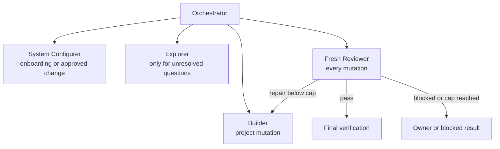
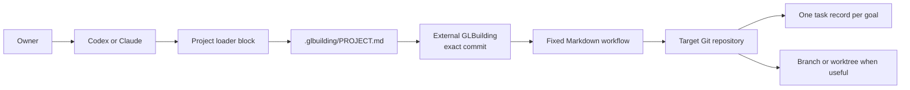
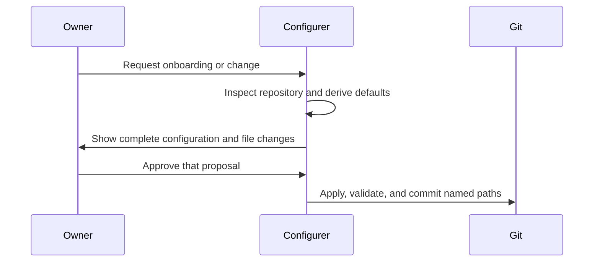
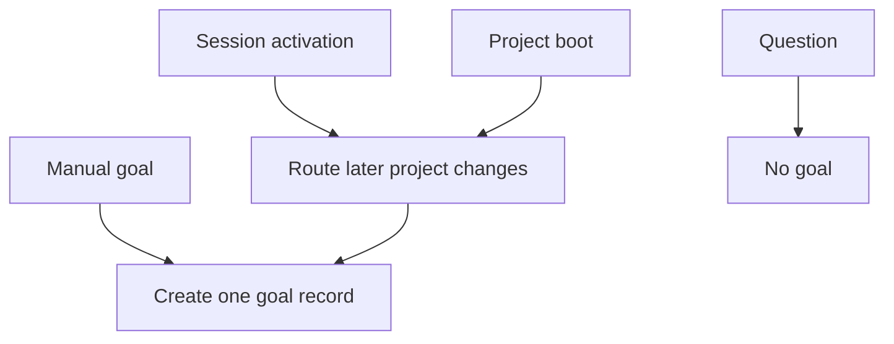
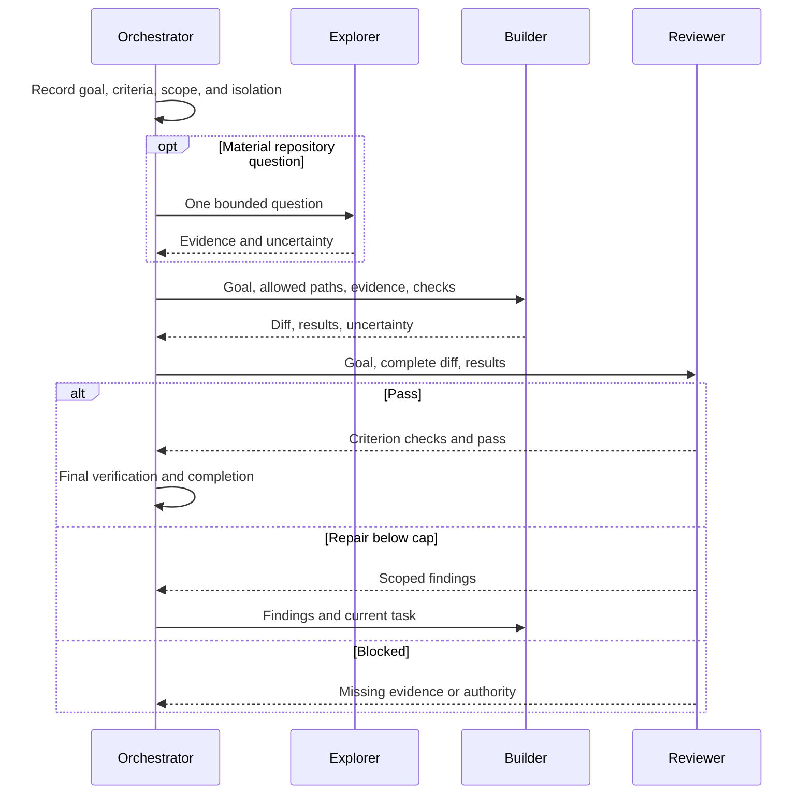

# GLBuilding framework white paper

## Abstract

GLBuilding is a Markdown-only workflow for agent-led software development. It addresses
a common failure mode: one long session must discover a large codebase, choose scope,
edit it, and judge its own work. Context fills with old assumptions and self-review
inherits the Builder's blind spots.

GLBuilding keeps one small Orchestrator context and sends bounded work to four worker
roles. Git stores project configuration and task records. Codex or Claude supplies the
agents and tools. GLBuilding supplies no runtime.

Its success criterion is product delivery. If its administration costs more than the
change, the framework has failed.

## Design thesis

The smallest useful graph is fixed:

Worker roles do not talk to each other. They return concise packets to the Orchestrator.
Only accepted results enter the goal record.

This design aims to keep:

1. discovery noise out of the Builder context;
2. Builder assumptions out of the Reviewer context;
3. owner attention on material decisions, not agent routing.

## System boundary

The framework does not call model APIs, schedule jobs, store conversations, or run a
service. The host uses its normal subagent and tool features.

The target project contains only:

- a small loader block in root `AGENTS.md` and `CLAUDE.md`;
- `.glbuilding/PROJECT.md`;
- `.glbuilding/tasks/<goal-id>.md` records.

The detailed framework stays outside the target repository at the pinned commit.

## Onboarding and configuration

The owner supplies a framework repository URL and full commit. The Configurer inspects
the target repository and derives a minimal configuration. It asks only questions that
change intent, boot mode, boundaries, or authority.

Configuration uses double opt-in:

The owner can select models, tools, review rounds, boot mode, protected paths, and scoped
custom instructions. The owner cannot change the five roles, hub communication, fresh
review requirement, or external-action gate.

## Activation

All activation paths enter the same flow:

PROJECT stores `manual` or `orchestration`. Session activation is temporary.
Deactivation stops new routing, not active work.

## Project knowledge

GLBuilding records three kinds of project knowledge:

- **Intent:** owner-approved direction.
- **Map:** code, interfaces, and documentation that locate the work.
- **Validation:** commands and evidence that can disprove a result.

Map and Validation are hints until verified against current code. This distinction is
important on large repositories: good documentation speeds work, but stale documentation
can misroute it. The Configurer records missing or stale sources. Explorer resolves only
the material gaps needed for a goal.

Native host instructions, project instructions, skills, and memory still exist. They can
supply context. They cannot change GLBuilding role duties or owner authority.

## Goal flow and handoffs

The task record contains outcomes, not whole conversations. It is short enough to read
at the start of a later session.

## Git and multiple goals

A simple sequential goal can use a clean current checkout or branch. Concurrent work or
unrelated dirty state uses a worktree. Relevant dirty work must first be committed or
explicitly kept in the current-checkout goal. Non-overlapping goals can run under one
Orchestrator. Overlapping paths or shared interfaces are serialized.

Worktrees isolate files, indexes, and `HEAD`. They do not lock shared services or prevent
semantic conflicts. GLBuilding therefore compares declared scope before parallel work.

Installation and goal delivery use normal project Git. Stage named paths, run normal
hooks, preserve unrelated work, and use the repository's commit policy. If hooks change
reviewed content, review the committed result again. A local commit does not prove
cross-host persistence.

## Owner authority

Routine approved work can read, edit, check, create local isolation, and create local
commits. The Orchestrator surfaces:

- major scope or architecture decisions;
- push, pull request, merge, deploy, publish, and release actions;
- force operations, secrets, remote deletion, and destructive data changes;
- paid services or other hard-to-reverse external effects.

Each external action needs fresh owner approval. Configuration cannot preauthorize it.

## Harness support

GLBuilding targets semantic outcomes, not provider tool names. A supported harness must:

- load the pinned Markdown pack;
- run a separate Builder with a bounded task;
- run a fresh Reviewer that did not build the change;
- read and edit the repository;
- run relevant project commands;
- ask the owner when required.

If Codex or Claude cannot follow this contract, that harness or mode is unsupported.
GLBuilding does not add transcript provenance, cryptographic manifests, or custom Git
transactions to prove that a host obeyed the workflow.

## Why no runtime graph framework

Runtime graph systems can provide durable checkpoints, human interrupts, and long-term
stores. They also add code, serialization, storage, deployment, and operations.
GLBuilding does not need those components to test its first claim.

Add a runtime only after real goals show that Markdown, native agents, and Git cannot
provide the needed result.

## External research

- The [Agent Skills specification](https://agentskills.io/specification) supports a
  portable `SKILL.md` entrypoint and progressive loading.
- OpenAI's [harness engineering report](https://openai.com/index/harness-engineering/)
  warns that one large `AGENTS.md` can crowd task and repository context.
- OpenAI's [agent-loop explanation](https://openai.com/index/unrolling-the-codex-agent-loop/)
  explains how project instructions and skills enter Codex context.
- Claude Code documents [version-controlled project instructions](https://code.claude.com/docs/en/memory)
  and [isolated subagents](https://code.claude.com/docs/en/sub-agents).
- Git documents how [worktrees](https://git-scm.com/docs/git-worktree.html) provide
  separate working trees while sharing repository state.
- [LangGraph](https://langchain-ai.github.io/langgraph/index.html) shows the runtime
  capabilities that GLBuilding deliberately defers.
- Microsoft's [AutoGen multi-agent debate pattern](https://microsoft.github.io/autogen/stable/user-guide/core-user-guide/design-patterns/multi-agent-debate.html)
  shows a peer graph. GLBuilding uses a hub because it needs handoffs, not open debate.

## Pitfalls and containment

### Ceremony cost

The main risk is that the framework becomes slower than the work. Configurer, Explorer,
and worktrees are conditional. Task records are short. Dogfood measures setup, build,
review, and finalization time separately.

### Stale project knowledge

Documentation can be wrong. Map and Validation remain hints. Agents verify material
claims in current code and state uncertainty instead of filling gaps.

### False fresh review

A Builder reviewing its own work preserves its assumptions. A supported harness uses a
different Reviewer context. A host that cannot do this is unsupported.

### Loop growth

Review rounds are capped at one to three, with two by default. Open findings at the cap
produce `blocked`, not another automatic loop.

### Partial installation

The Configurer shows the complete configuration and changed files, waits for approval,
rechecks affected paths, stages named files, and uses normal Git. A conflict stops the
install. The framework does not promise a database transaction.

### Dirty or concurrent work

Unrelated owner work is preserved and can be isolated with a worktree. Relevant dirty
work must be committed or explicitly included before isolation. Overlapping goals are
serialized because filesystem separation does not prevent design conflicts.

### False durability

A local commit survives only where that Git history survives. Remote persistence uses
the project's normal owner-approved Git flow.

### Harness variance

Codex and Claude can interpret the same Markdown differently. Test each harness on the
simple workflow. Record `supported`, `unsupported`, or `untested`; do not infer parity.

## Evaluation

GLBuilding succeeds only when it improves delivery:

- fewer owner routing steps and corrections;
- equal or better acceptance coverage;
- one independent review before completion;
- no unbounded repair loop;
- lower elapsed time or owner attention than the prior unstructured process.

Dogfood records setup, build, review, finalization, owner input, findings, repairs, scope
escapes, and remaining uncertainty. One successful run is directional evidence, not
general proof.
