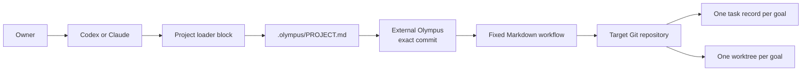
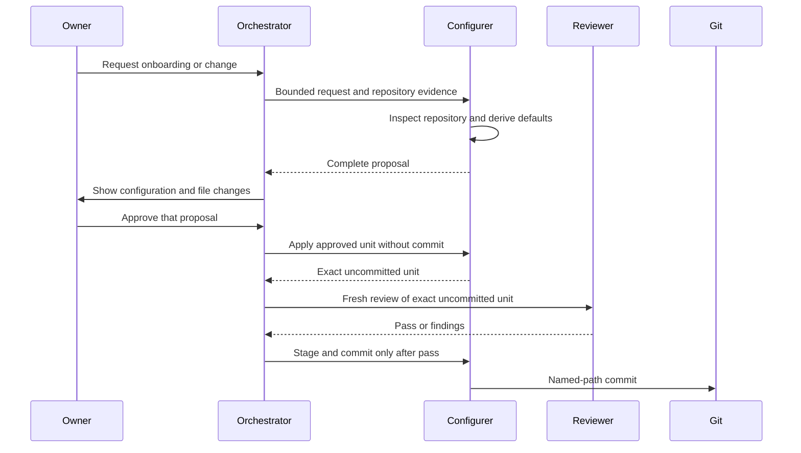

# Olympus framework white paper

## Abstract

Olympus is a Markdown-only workflow for agent-led software development. It addresses
a common failure mode: one long session must discover a large codebase, choose scope,
edit it, and judge its own work. Context fills with old assumptions and self-review
inherits the Builder's blind spots.

Olympus keeps one small Orchestrator context and sends bounded work to a fixed
conditional catalog of fifteen roles. Git stores project configuration and task records.
Codex or Claude supplies the agents and tools. Olympus supplies no runtime. Its
success criterion is product delivery: administration that costs more than the change is
a failure.

The [runtime protocol](../references/PROTOCOL.md) is the canonical operational contract.
This paper explains the design and its limits.

## Design thesis

The smallest useful graph is fixed, and every role outcome returns to the Orchestrator.
The [runtime protocol](../references/PROTOCOL.md) is the canonical catalog and trigger
contract:

```mermaid
flowchart TD
    O[Orchestrator] --> C[System Configurer<br/>onboarding or approved change]
    O --> E[Explorer<br/>material question or audit]
    O --> S[Spec Writer<br/>substantial goal]
    O --> CR[Claims Reviewer<br/>fresh after spec]
    O --> SR[Spec Reviewer<br/>fresh after spec]
    O --> P[Plan Writer<br/>dependent steps]
    O --> PV[Plan Verifier<br/>fresh after plan]
    O --> B[Builder<br/>project mutation]
    O --> D[Docs Writer<br/>conditional after builder]
    O --> R[Fresh Reviewer<br/>every mutation]
    O --> DR[Design Reviewer<br/>conditional after mutation]
    O --> RA[Release Agent<br/>release boundary]
    O --> DC[Decision Council<br/>advisory]
    O --> L[Liaison<br/>status]
    C --> O
    E --> O
    S --> O
    CR --> O
    SR --> O
    P --> O
    PV --> O
    B --> O
    D --> O
    DR --> O
    RA --> O
    DC --> O
    L --> O
    R -->|review packet| O
    O -->|repair below cap| B
    O -->|pass| V[Final verification]
    O -->|blocked or cap reached| H[Owner or blocked result]
```



Roles do not talk to each other. They return concise packets to the Orchestrator. Only
accepted results enter the goal record. This keeps:

1. discovery noise out of the Builder context;
2. Builder assumptions out of the Reviewer context;
3. owner attention on material decisions, not agent routing.

## System boundary



The framework does not call model APIs, schedule jobs, store conversations, or run a
service. The host uses its normal subagent and tool features. The target project contains
only loader blocks, `.olympus/PROJECT.md`, and `.olympus/tasks/<goal-id>.md` records.
The detailed framework stays outside the target repository at the pinned commit.

## Configuration boundary

The owner supplies a framework repository URL and an optional ref; the ref defaults to
`main` and is resolved once to the full commit PROJECT records. The Configurer inspects
the target repository and derives a minimal configuration. It asks only questions that
change intent, boot mode, boundaries, or authority.

Configuration uses double opt-in:



The owner can select models, tools, review rounds, boot mode, protected paths, matching
design standards, and scoped custom instructions. Fixed roles, trigger floors, hub
communication, fresh review, and the external-action gate remain unchanged. Configuration
is applied uncommitted and receives a fresh review before staging or commit.

## Project knowledge

Olympus records three kinds of project knowledge in PROJECT:

- **Intent:** owner-approved direction.
- **Map:** code, interfaces, and documentation that locate the work.
- **Validation:** commands and evidence that can disprove a result.

Map and Validation are hints until verified against current code. Good documentation
speeds work, but stale documentation can misroute it. The Configurer records missing or
stale sources. Explorer resolves only the material gaps needed for a goal.

Native host instructions, project instructions, skills, and memory can supply context.
They cannot change Olympus role duties or owner authority.

## Goal architecture

```mermaid
sequenceDiagram
    participant O as Orchestrator
    participant E as Explorer
    participant S as Spec Writer
    participant CR as Claims Reviewer
    participant SR as Spec Reviewer
    participant P as Plan Writer
    participant PV as Plan Verifier
    participant B as Builder
    participant D as Docs Writer
    participant R as Reviewer
    participant DR as Design Reviewer
    participant RA as Release Agent
    O->>O: Record goal, criteria, scope, and isolation
    O->>O: Validate optional role allowlist and request boundary
    opt Material repository question
        O->>E: One bounded question
        E-->>O: Evidence and uncertainty
    end
    opt Substantial, ambiguous, architectural, or cross-layer goal
        O->>S: Bounded goal packet
        S-->>O: Complete traceable specification, identifier, and hash
        O->>O: Persist body, verify hash
        O->>CR: Same immutable packet, identifier, and hash
        O->>SR: Same immutable packet, identifier, and hash
        CR-->>O: Complete claim packet, hash-mismatch defect, or halted return
        SR-->>O: Complete specification packet, hash-mismatch defect, or halted return
        alt Both complete packets return
            O->>O: Count completed round and freeze finding ledger
        else Defect or halted attempt
            O->>O: Preserve provisional findings; count zero rounds
            O->>O: Correct the handoff or retry once, then escalate
        end
    end
    opt Plan trigger holds
        O->>P: Accepted contract or specification
        P-->>O: Complete plan with identity and hash
        O->>O: Persist plan and verify identity
        O->>PV: Contract and exact persisted plan
        PV-->>O: Matching plan identity and verdict
    end
    O->>B: Goal, accepted specification and plan identities, paths, evidence, checks
    B-->>O: Diff, results, uncertainty
    opt Documentation trigger holds
        O->>D: Complete behavior diff and approved docs
        D-->>O: Documentation result
    end
    O->>R: Goal, complete diff, results
    R-->>O: General review verdict
    opt Design trigger holds
        alt Matching standards available
            O->>DR: Diff and matching standards
            DR-->>O: Design verdict
        else Required standards missing
            O->>O: Record blocked
        end
    end
    alt Every invoked review passes
        O->>O: Final verification
        opt Owner requests release preparation, reconciliation, or one external action
            O->>RA: Preparation fields or approved action and evidence
            RA-->>O: Per-action release result and read-back evidence
        end
        O->>O: Completion
    else Repair below cap
        O->>B: Aggregated findings and current task
    else Blocked
        O->>O: Record missing evidence or authority
    end
```

The task record contains outcomes, predicted and actual role population, support evidence,
and uncertainty, not whole conversations. Activation modes enter this same flow; questions
do not create goals. Decision Council can advise on one unresolved trade-off, and Liaison
can answer a human status request, but neither changes the graph or grants authority.

The owner may provide one ordered role allowlist and one request boundary. This selection is
not a new graph or an invocation list. Fixed triggers, paired verification, fresh review,
owner approval, support evidence, protected paths, bounded loops, and sole-hub routing remain
mandatory. Invalid or incompatible declarations dispatch no worker, and a later unselected
trigger stops as `pending-expansion`. The canonical rules are in the [owner-selected
workflow](../references/PROTOCOL.md#owner-selected-workflow) and [task release
records](../templates/TASK.md#release-boundary-records).

The [Release Agent](../agents/RELEASE_AGENT.md) owns only the provider-neutral release
boundary. Preparation validates the reviewed commit, action, target, and desired
post-state, and reconciles current provider state read-only. One single-use owner
approval covers one action kind and one target. The Release Agent has no file or
standing external authority and makes at most one provider action submission per
approval; read-only capability and read-back calls do not consume it. These are Markdown
contracts and static fixtures. They do not prove live provider support, release
execution, production readiness, or general harness support.

## Why no runtime graph framework

Runtime graph systems can provide durable checkpoints, human interrupts, and long-term
stores. They also add code, serialization, storage, deployment, and operations.
Olympus does not need those components to test its first claim. Add a runtime only
after real goals show that Markdown, native agents, and Git cannot provide the result.

## External research

- The [Agent Skills specification](https://agentskills.io/specification) supports a
  portable `SKILL.md` entrypoint and progressive loading.
- OpenAI's [harness engineering report](https://openai.com/index/harness-engineering/)
  warns that one large `AGENTS.md` can crowd task and repository context.
- OpenAI's [agent-loop explanation](https://openai.com/index/unrolling-the-codex-agent-loop/)
  explains how project instructions and skills enter Codex context.
- Claude Code documents [version-controlled project instructions](https://code.claude.com/docs/en/memory)
  and [isolated subagents](https://code.claude.com/docs/en/sub-agents).
- Git documents how [worktrees](https://git-scm.com/docs/git-worktree.html) provide
  separate working trees while sharing repository state.
- [LangGraph](https://langchain-ai.github.io/langgraph/index.html) shows the runtime
  capabilities that Olympus deliberately defers.
- Microsoft's [AutoGen multi-agent debate pattern](https://microsoft.github.io/autogen/stable/user-guide/core-user-guide/design-patterns/multi-agent-debate.html)
  shows a peer graph. Olympus uses a hub because it needs handoffs, not open debate.

## Pitfalls and containment

### Ceremony cost

The main risk is that the framework becomes slower than the work. Configurer, Explorer,
specification, planning, Docs Writer, Design Reviewer, Council, and Liaison are
conditional. Task records stay short. Dogfood measures setup, build, review, and
finalization separately.

### Stale project knowledge

Documentation can be wrong. Map and Validation remain hints. Agents verify material
claims in current code and state uncertainty instead of filling gaps.

### False fresh review

A Builder reviewing its own work preserves its assumptions. A supported harness uses a
different Reviewer context. A host that cannot do this is unsupported.

### Loop growth

Specification review is capped at ten completed rounds and expects closure in two or three.
Halted attempts do not consume that cap. One fresh retry is automatic; another runtime
failure escalates. Other review brackets keep their smaller configured caps. Any open P0,
P1, or P2 at a cap produces `blocked`, not another automatic loop. An open P3 does not
block.

### Partial installation

The Configurer generates the complete configuration and changed files, presents the
compact approval surface with the exact detail available on request, waits for approval,
rechecks affected paths, applies the exact unit uncommitted, pauses for a fresh Reviewer,
then stages named files after a pass and uses normal Git. A conflict stops the install.
The framework does not promise a database transaction. See the [installation
guide](INSTALLATION.md) and [System Configurer charter](../agents/SYSTEM_CONFIGURER.md).

### Dirty or concurrent work

Each goal runs in its own worktree from the committed working-directory HEAD by
default, so unrelated owner work is never edited. Relevant dirty work must be committed
or explicitly included before a current-checkout goal, which project policy may permit
for simple sequential work. Goal closure records the branch
disposition and removes the worktree only after merge, safe handoff, or explicit owner
abandonment. Overlapping goals are serialized because filesystem separation does not
prevent design conflicts.

### False durability

A local commit survives only where that Git history survives. Remote persistence uses
the project's normal owner-approved Git flow.

### Harness variance

Codex and Claude can interpret the same Markdown differently. Test each harness on the
simple workflow and each role invoked by a goal. Record `supported`, `unsupported`, or
`untested`; do not infer parity or role support from tool availability. The framework does
not add provenance machinery to force obedience.

## Evaluation

Olympus succeeds only when it improves delivery:

- fewer owner routing steps and corrections;
- equal or better acceptance coverage;
- one independent review before completion;
- no unbounded repair loop;
- lower elapsed time or owner attention than the prior unstructured process.

Dogfood records setup, build, review, finalization, owner input, findings, repairs, scope
escapes, and remaining uncertainty. One successful run is directional evidence, not
general proof.
